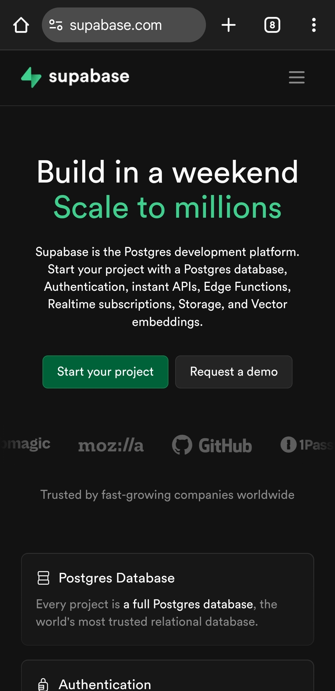

# Application Architecture

This document outlines the high-level architecture of the Transaction Tracker.

## Overall Structure

The application follows a client-server architecture, with a React Native frontend communicating with a Supabase backend.

## Frontend (React Native / Expo)

*   **Navigation:** Uses `@react-navigation` for stack and tab navigation.
*   **State Management:** React's `useState` and `useEffect` hooks are primarily used for local component state. Global state is managed through context or passed down via props.
*   **Components:** UI is built using reusable React Native components, organized into `src/components` and `src/screens`.
*   **Services:** External interactions (e.g., Supabase API calls, location tracking, notifications) are encapsulated in `src/services`.

## Backend (Supabase)

*   **Database:** PostgreSQL database managed by Supabase.
*   **Authentication:** Supabase Auth handles user registration, login, and session management.
*   **Realtime:** Supabase Realtime is used for features like global chat and real-time collaboration.
*   **Edge Functions:** Serverless functions (e.g., for sending notifications, archiving customers) are deployed as Supabase Edge Functions.

## Data Flow

[Describe the general data flow, e.g., User interaction -> Component -> Service -> Supabase API -> Database -> Realtime updates -> Component.]

## Key Modules/Folders

*   `src/screens`: Contains the main screens of the application.
*   `src/components`: Contains reusable UI components.
*   `src/services`: Contains logic for interacting with external APIs and services.
*   `supabase/edge-functions`: Contains serverless functions deployed to Supabase.
