# Application Navigation

This document describes the navigation structure of the Transaction Tracker, primarily managed using `@react-navigation`.

## Main Navigation Flow

The application uses a combination of Stack Navigators and Tab Navigators to manage screen transitions.

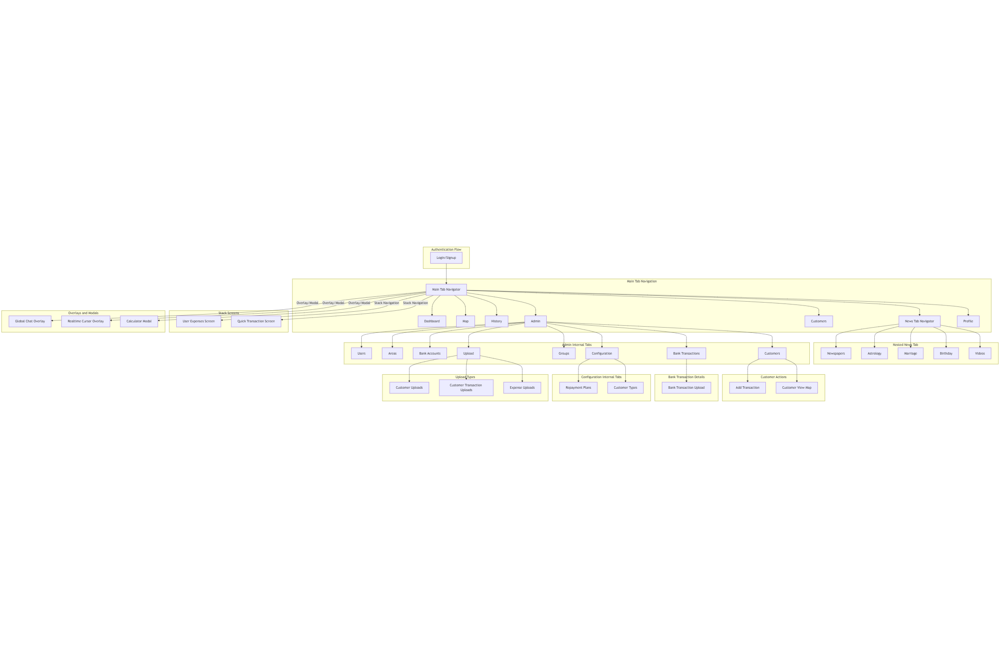

📥 [Download Latest APK](../releases/locationtracker_v1.0.0.7z)

### Authentication Flow

Users first encounter the authentication flow:

*   [`LoginScreen`](screens/LoginScreen.md)

[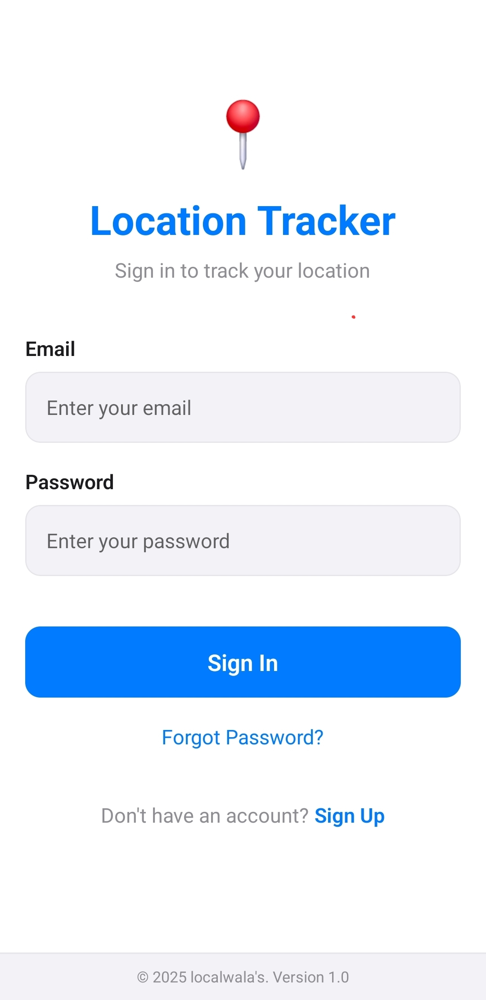](images/app-login-screen.png)

*   [`SignupScreen`](screens/SignupScreen.md)

[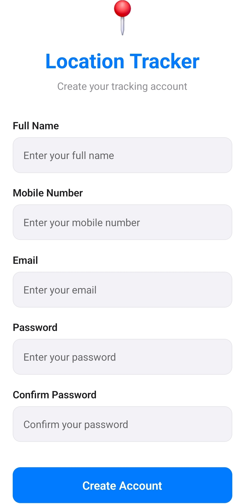](images/login-signup-screens.png)

Upon successful authentication, the user is directed to the `Main` screen, which hosts the primary tab navigation.

### Main Tab Navigation (`TabNavigator`)

The main part of the application uses a bottom tab navigator, with tabs visible based on the user's role.

*   📊 **Dashboard:** ([`DashboardScreen`](screens/DashboardScreen.md)) - Home screen with an overview.
*   🗺️ **Map:** ([`MapScreen`](screens/MapScreen.md)) - Displays map functionalities. (Visible to `admin`/`superadmin`)
*   📜 **History:** ([`LocationHistoryScreen`](screens/LocationHistoryScreen.md)) - Shows location history. (Visible to `admin`/`superadmin`)
*   ⚙️ **Admin:** ([`AdminScreen`](screens/AdminScreen.md)) - Administrative functionalities. (Visible to `admin`/`superadmin`)

### Admin Screen Internal Tabs

The 'Admin' screen itself contains several internal sections managed by a custom tab system:

*   👥 **Users:** ([`Users.md`](admin-modules/Users.md)) - Manages user accounts.

[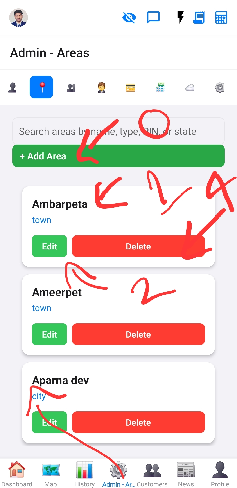](images/superadmin-admin-screen.png)

*   📍 **Areas:** ([`Areas.md`](admin-modules/Areas.md)) - Manages geographical areas.

*   🤝 **Groups:** ([`Groups.md`](admin-modules/Groups.md)) - Manages user groups.

[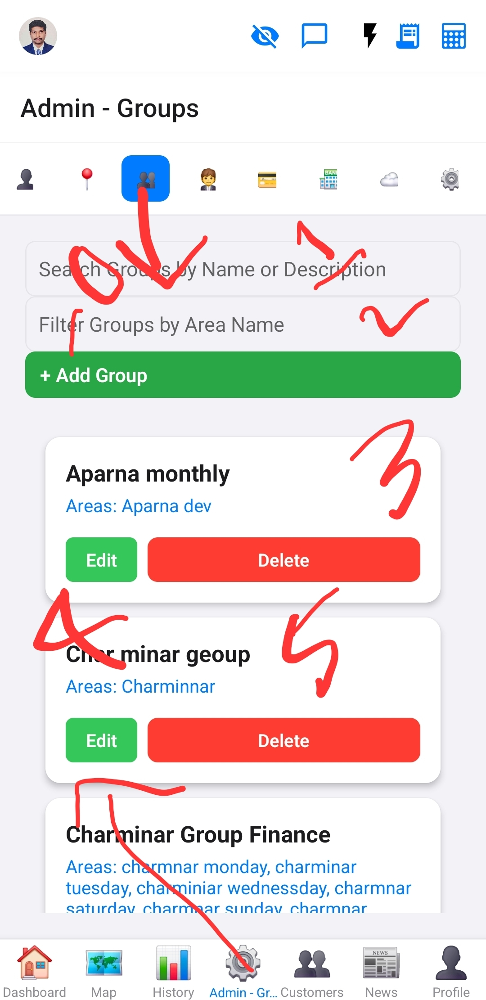](images/admin-groups-tab.png)

*   🧑‍🤝‍🧑 **Customers:** ([`CreateCustomerScreen`](screens/CreateCustomerScreen.md)) - Manages customer data.

    *   Add Transaction
    *   Customer View Map

*   💰 **Bank Transactions:** ([`BankTransactions.md`](admin-modules/BankTransactions.md)) - Manages bank transaction data.
    *   Bank Transaction Upload

[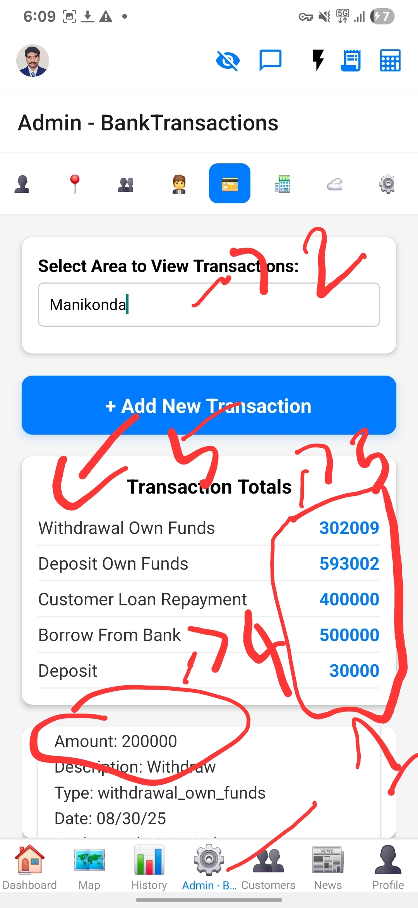](images/admin-bank-transactions-tab.png)

*   🏦 **Bank Accounts:** ([`BankAccounts.md`](admin-modules/BankAccounts.md)) - Manages bank accounts.

[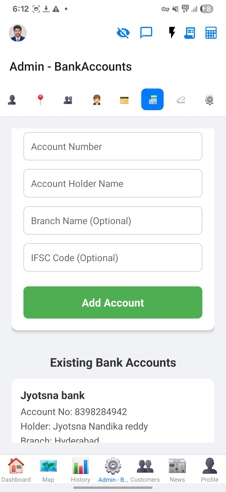](images/admin-bank-accounts-tab.png)

*   ⬆️ **Upload:** ([`Upload.md`](admin-modules/Upload.md)) - Handles various data uploads:
    *   Customer Uploads (CSV)
    *   Customer Transaction Uploads (CSV)
    *   Expense Uploads (CSV)

[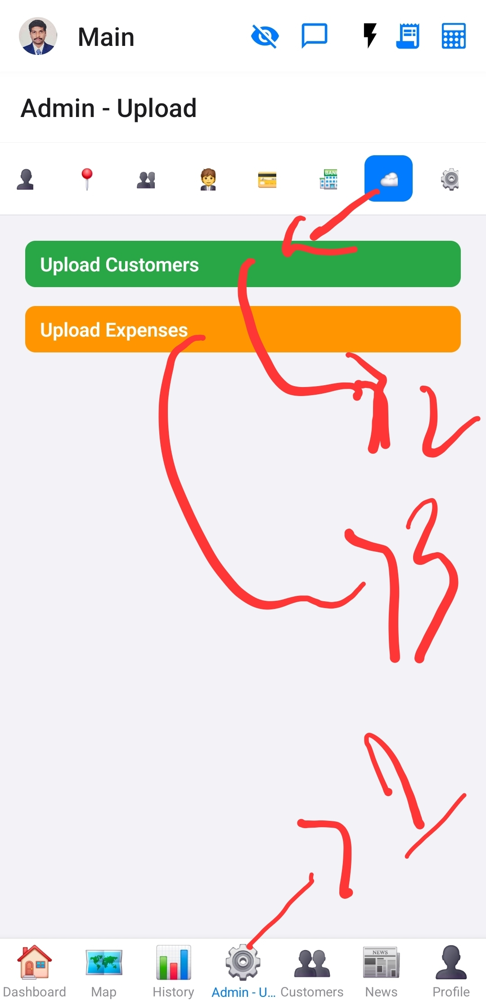](images/admin-upload.png)[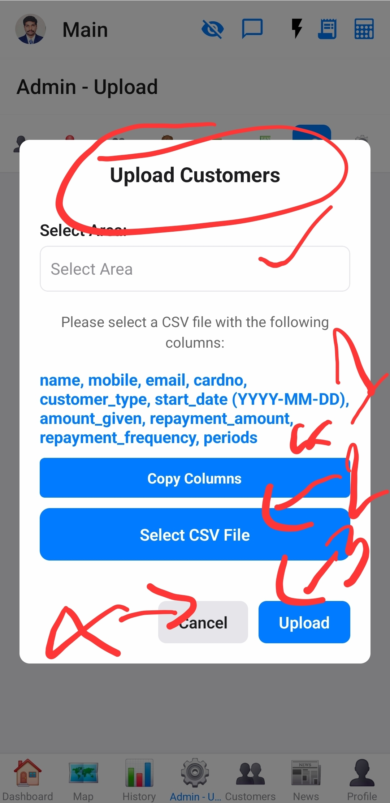](images/admin-upload1.png)

*   ⚙️ **Configuration:** ([`Configuration.md`](admin-modules/Configuration.md)) - Contains nested configuration tabs.

#### Configuration Internal Tabs

The 'Configuration' tab itself contains nested sections:

*   🗓️ **Repayment Plans:** ([`RepaymentPlans.md`](admin-modules/RepaymentPlans.md)) - Manages repayment plan settings.

[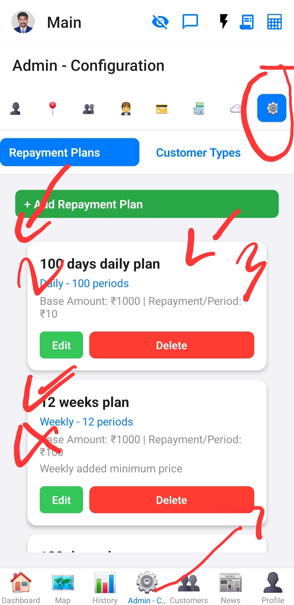](images/admin-repayment-plans-tab.png)

*   🏷️ **Customer Types:** ([`CustomerTypes.md`](admin-modules/CustomerTypes.md)) - Manages customer type definitions.

[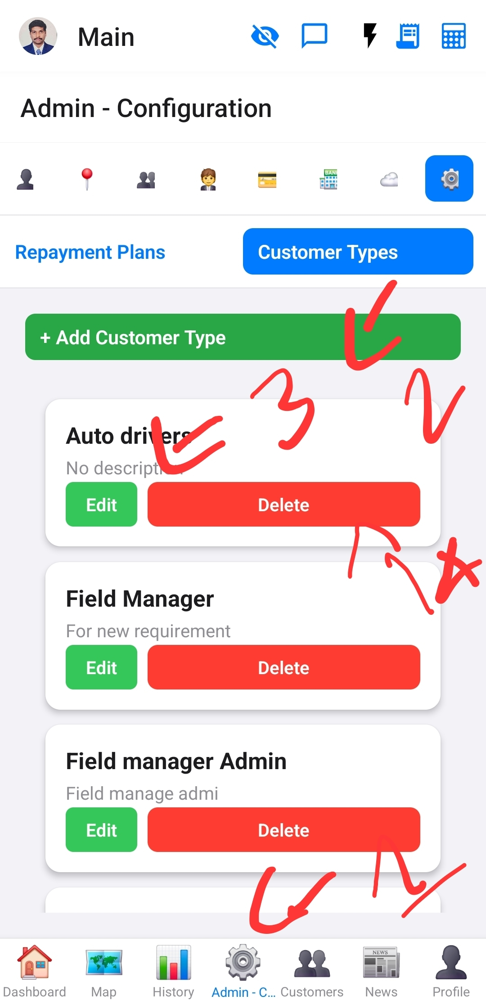](images/admin-customer-types-tab.png)
*   🧑‍🤝‍🧑 **Customers:** ([`CreateCustomerScreen`](screens/CreateCustomerScreen.md)) - Manages customer data.
*   **News:** (`NewsTabs`) - A nested tab navigator for news-related content.
*   **Profile:** ([`ProfileScreen`](screens/ProfileScreen.md)) - User profile management.

[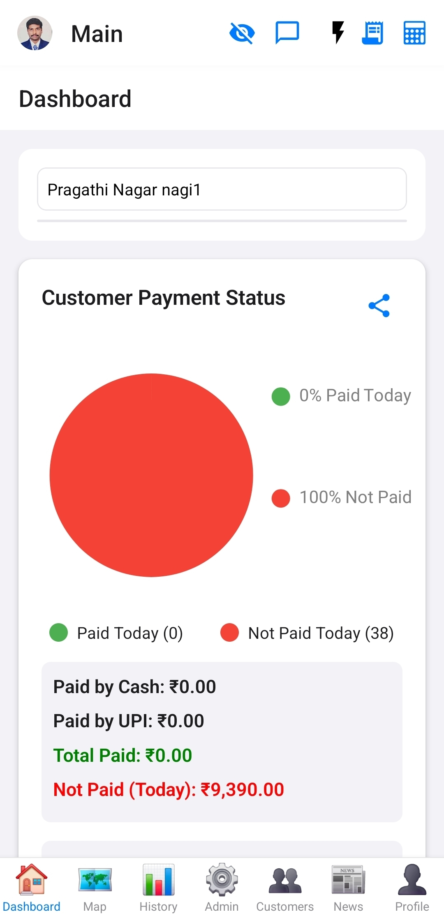](images/main-tab-bar.png)

### Nested News Tab Navigation (`NewsTabs`)

The 'News' tab itself contains a nested bottom tab navigator:

*   **Newspapers:** ([`NewsPaperScreen`](screens/NewsPaperScreen.md)) - Displays various online newspapers.
*   **Astrology:** ([`AstrologyWebviewScreen`](screens/AstrologyWebviewScreen.md)) - Astrology-related content.
*   **Marriage:** ([`MarriageScreen`](screens/MarriageScreen.md)) - Marriage-related content.
*   **Birthday:** ([`BirthdayScreen`](screens/BirthdayScreen.md)) - Birthday-related content.
*   **Videos:** ([`YouTubeScreen`](screens/YouTubeScreen.md)) - Video content, likely from YouTube.

[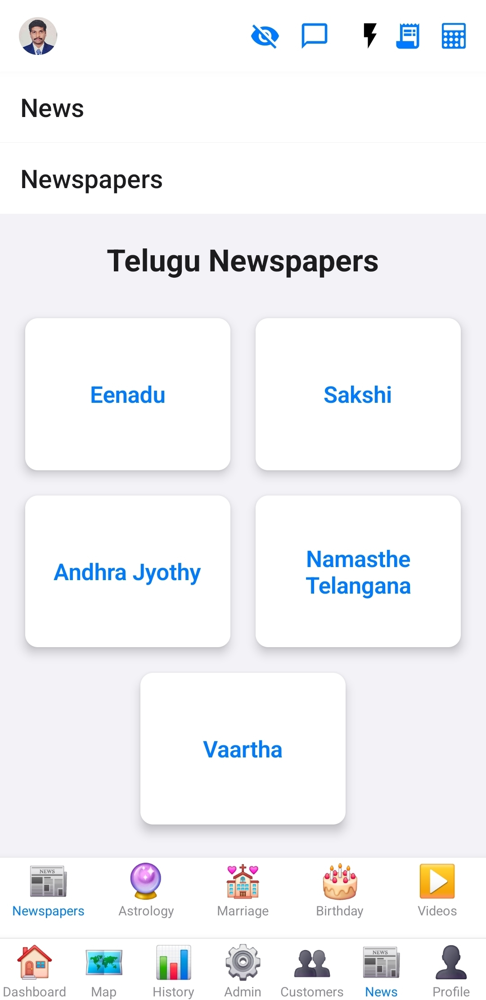](images/news-tab-bar.png)

### Stack Screens (Accessed from various points)

Beyond the main tabs, several screens are part of the main stack navigator and can be navigated to from different parts of the app:

*   ([`UserExpensesScreen`](screens/UserExpensesScreen.md) (Accessed via 'Expenses' button in header))

[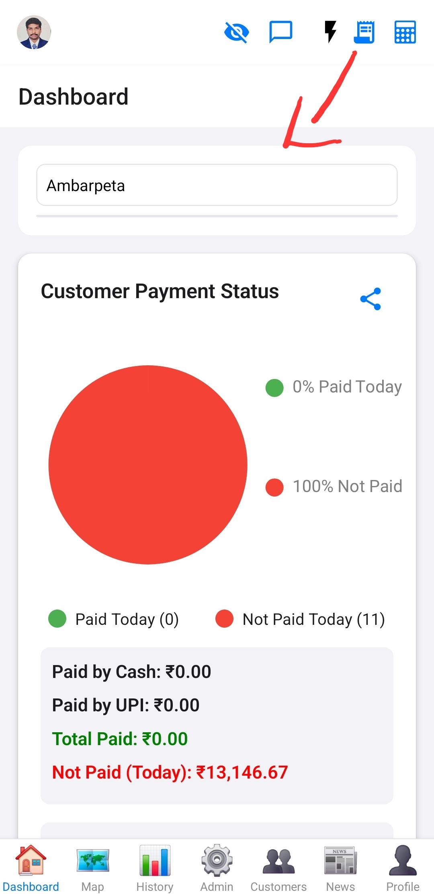](images/user-expenses-screen.png)
[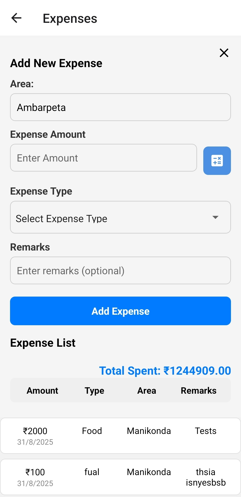](images/user-expenses-screen1.png)

*   ([`QuickTransactionScreen`](screens/QuickTransactionScreen.md) (Accessed via 'QuickTransaction' button in header))

[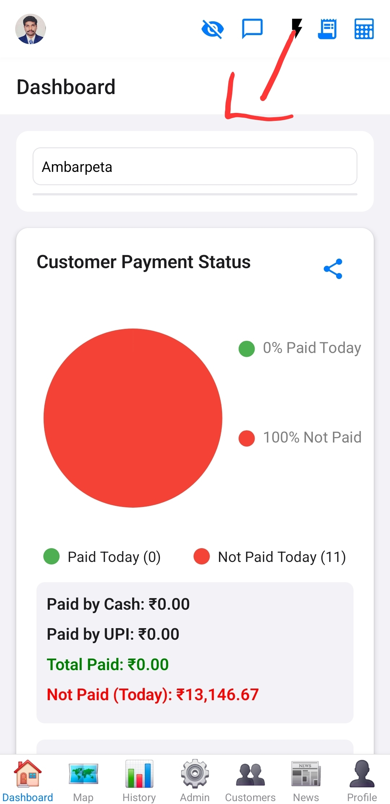](images/quick-transaction-screen.png)
[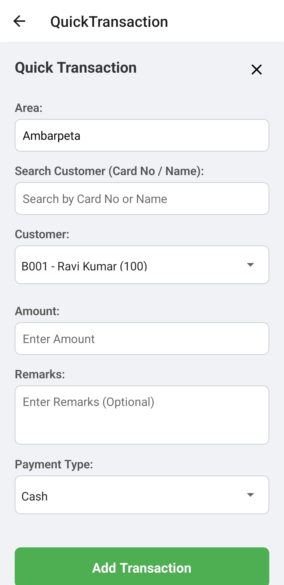](images/quick-transaction-screen1.png)

[Watch a video of an Example Stack Screen](https://youtube.com/your_video_link_here)

### Overlays and Modal Components

These are components that appear on top of other screens, but do not replace them.

*   **Global Chat:** A real-time chat window that can be opened over any screen. ([`GlobalChatAndPresence.md`](components/GlobalChatAndPresence.md))

[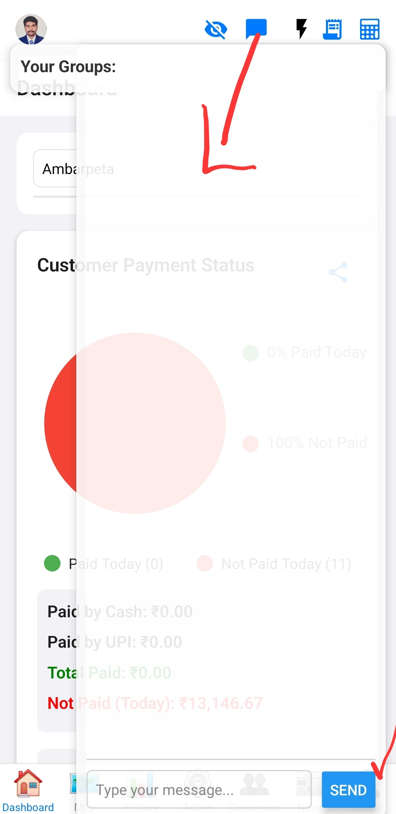](images/global-chat-interface.png)
*   **Realtime Cursor:** An overlay that displays the cursor positions of other active users. ([`RealtimeCursorDisplay.md`](components/RealtimeCursorDisplay.md))

[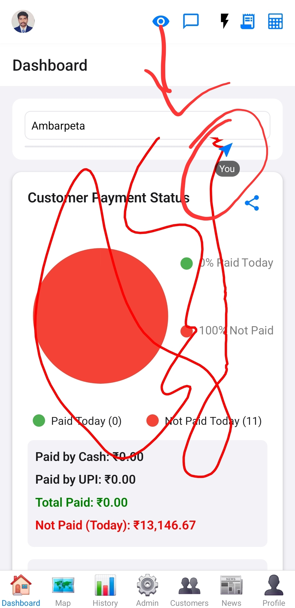](images/realtime-cursor-display.png)
*   **Calculator Modal:** A popup calculator for performing quick calculations. ([`CalculatorModal.md`](components/CalculatorModal.md))

[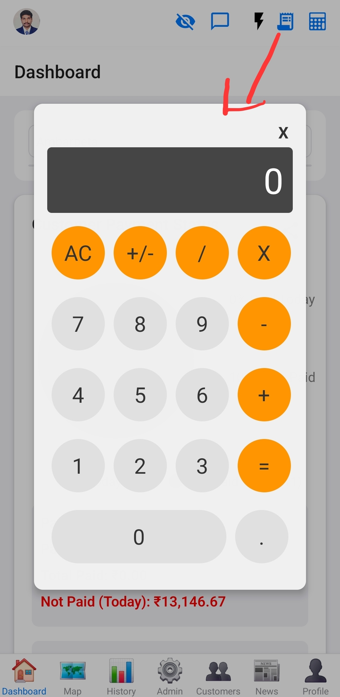](images/calculator-modal.png)

[Watch a video of an Example Stack Screen](https://youtube.com/your_video_link_here)
