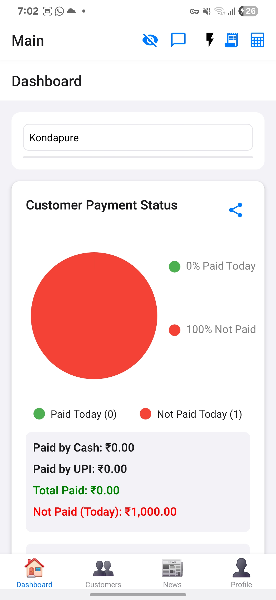
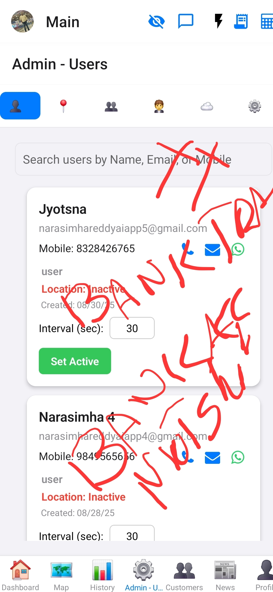
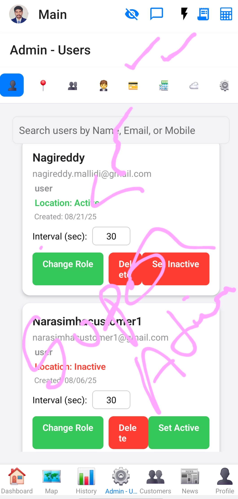

# User Roles and Permissions

This document outlines the different user roles within the Transaction Tracker and their associated permissions, primarily focusing on access to different sections and features.

User roles are determined by the `user_type` field in the user's profile, which is stored in the `users` table in Supabase.

## Role Definitions and Access

### 1. `user` (General User)

This is the basic user type. They have access to core functionalities and information relevant to a standard user.

*   **Access:**
    *   Dashboard
    *   Customers
    *   News (including Newspapers, Astrology, Marriage, Birthday, Videos)
    *   Profile
*   **No Access:**
    *   Map
    *   History
    *   Admin

### 2. `customer`

This role is specifically designed for customer accounts. In terms of main navigation, their access is similar to a general `user`.

*   **Access:**
    *   Dashboard
    *   Customers
    *   News (including Newspapers, Astrology, Marriage, Birthday, Videos)
    *   Profile
*   **No Access:**
    *   Map
    *   History
    *   Admin

### 3. `admin`

Administrators have elevated privileges. Their access to specific areas is **limited to those explicitly granted by a `superadmin`** through the "Group Tab" or similar configuration within the administrative interface.

*   **Access:**
    *   Dashboard
    *   Customers
    *   News (including Newspapers, Astrology, Marriage, Birthday, Videos)
    *   Profile
    *   Map (if granted)
    *   History (if granted)
    *   Admin (Access to the administrative panel, with features limited by superadmin configuration)

### 4. `superadmin`

The `superadmin` role represents the highest level of administrative access. A `superadmin` has **unrestricted access to all areas and functionalities** of the application, including the ability to configure permissions for `admin` users.

*   **Access:**
    *   Dashboard
    *   Customers
    *   News (including Newspapers, Astrology, Marriage, Birthday, Videos)
    *   Profile
    *   Map (Full Access)
    *   History (Full Access)
    *   Admin (Full Access, including user/group permission management)

**Note:** While `superadmin` and `admin` might appear to have similar tab visibility in the main navigation, the `superadmin` possesses the underlying authority to control `admin` permissions and access all data/features without restriction.

