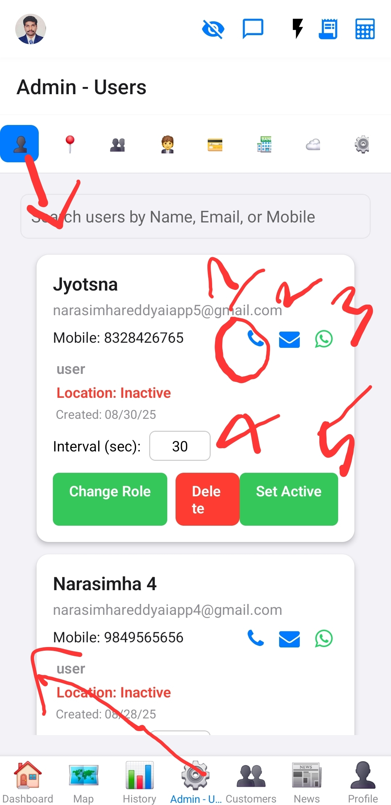

# Admin Screen

This screen provides administrative functionalities for managing the application, accessible only to `admin` and `superadmin` roles.

## Purpose

To allow authorized personnel to perform administrative tasks, such as user management, system configuration, or data oversight.

## Components

*   User management tools.
*   System settings.
*   Data reports or dashboards.

