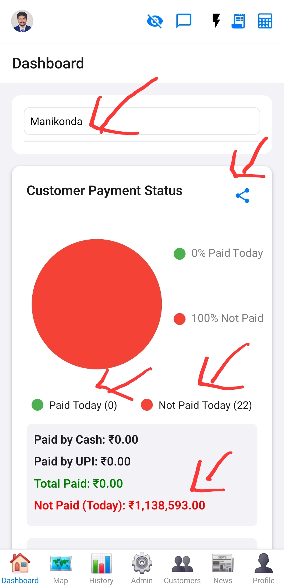
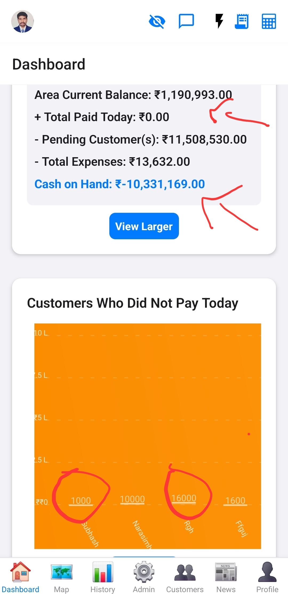
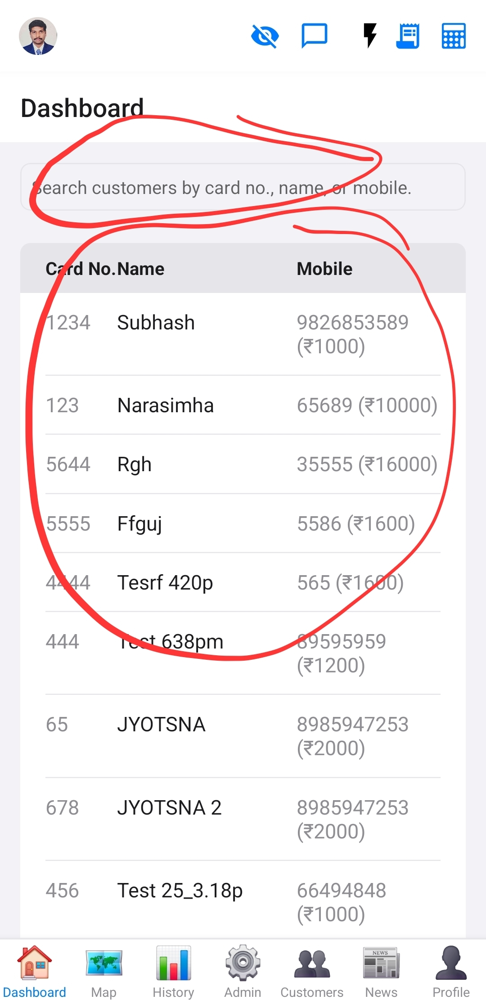

# Dashboard Screen

This is the main landing screen for authenticated users, providing an overview of key information and quick access to various features.

## Purpose

To provide a centralized hub for users to view important data and navigate to other parts of the application.

## Functionality
*   **Area Selection:** Allows the user to select a specific geographical area to view data for.
*   **Payment Status Overview (Pie Chart):** Displays a pie chart showing the proportion of "Paid Today" vs. "Not Paid Today" customers for the selected area. Clicking on a slice updates the customer list and bar chart below.
*   **Payment Summary:** Shows totals for Paid by Cash, Paid by UPI, Total Paid, and Total Not Paid (Today).
*   **Financial Overview:** Calculates and displays Area Current Balance, Total Amount Given (to pending customers), Total Expenses, and Cash on Hand.
*   **Customer List & Search:** Displays a list of customers based on the selected pie chart slice. Includes a search bar to filter customers by card number, name, or mobile. Allows expanding individual customer items to view detailed repayment information.
*   **Bar Chart:** Dynamically updates to show customer names and their expected repayment amounts for the currently displayed customer list.
*   **CSV Export:** Provides a button to generate and share a CSV report of today's transaction data for the selected area.
*   **Location Tracking Status:** Displays the user's location tracking status.
*   **Profile Modal:** Shows a modal with the user's profile photo.
*   **Large Chart Modal:** Allows viewing the pie or bar charts in a larger, dedicated modal.
*   **Refresh Control:** Supports pull-to-refresh functionality to update data.

## Data Sources
*   Supabase (for fetching users, customers, areas, transactions, expenses, and payment summaries via RPC calls).
*   `locationTracker` service.

## Components Used
*   [`AreaSearchBar`](../../src/components/AreaSearchBar.js)
*   [`LargeChartModal`](../../src/components/LargeChartModal.js)
*   [`CalculatorModal`](../../src/components/CalculatorModal.js)

## Images

