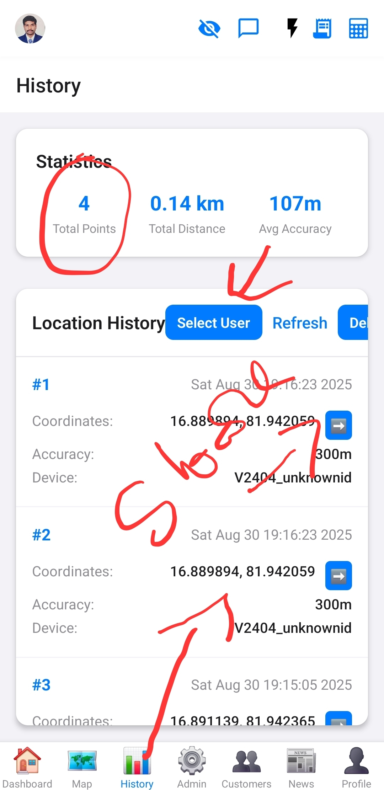

# Location History Screen

This screen displays a user's historical location data.

## Purpose

To allow authorized users (admins/superadmins) to review the location history of specific users.

## Functionality
*   **Location History List:** Displays a list of recorded location points for a selected user, including coordinates, timestamp, accuracy, and device name.
*   **User Selection (Superadmin/Group Admin):** Allows superadmins to select any user, and group admins to select users within their administered groups, to view their location history.
*   **Location Statistics:** Calculates and displays statistics for the loaded location data: Total Distance traveled, Average Accuracy, and Total Number of Points recorded.
*   **Get Directions:** For each location point, a button is provided to open Google Maps directions to that specific coordinate.
*   **Refresh Data:** Allows refreshing the location history list.
*   **Debug DB:** A button to check the number of location records in the database (likely for debugging purposes).
*   **Permissions Handling:** Requests foreground location permissions.
*   **Empty State:** Displays a message when no location history is found.

## Data Sources
*   Supabase (for fetching user lists, user groups, and location history data).

## Components Used
*   `Modal` (from React Native)
*   `TextInput` (from React Native)
*   `FlatList` (from React Native)

## Images

