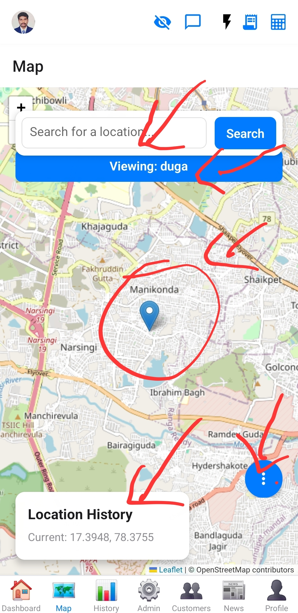
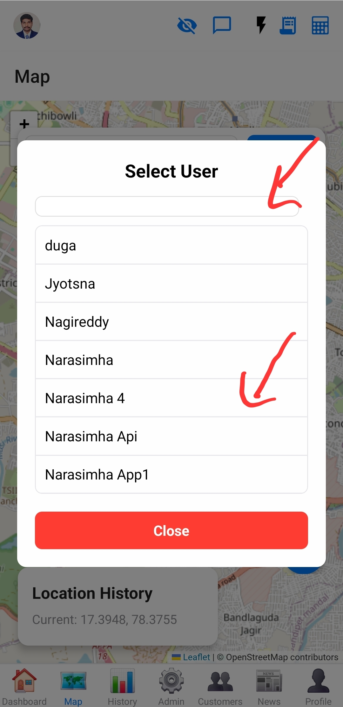
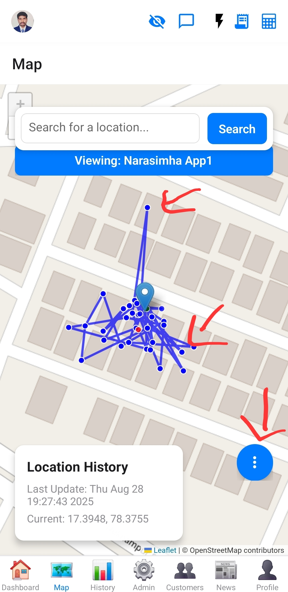

# Map Screen

This screen provides a map interface, likely for tracking or displaying real-time locations.

## Purpose

To visualize geographical data, such as user locations or customer points of interest.

## Functionality
*   **Current Location Display:** Fetches and displays the user's current geographical location.
*   **User Location History:** Loads and displays historical location data for the current user or a selected user (for superadmins/group admins).
*   **Interactive Map:** Integrates a `LeafletMap` component to visualize locations.
    *   **Map Controls:** Provides buttons to center on current location, fit map to route, clear map, refresh data, and get directions (opens Google Maps).
*   **Location Search:** Allows searching for a location by text (geocoding) and centering the map on the search result.
*   **Date Filtering:** Enables filtering location history by a date range.
*   **Superadmin User Selection:** Superadmins can select specific users to view their location history.
*   **Web Fallback:** Provides a text-based fallback for web platforms where the interactive map might not be available.
*   **Permissions Handling:** Requests foreground location permissions.

## Data Sources
*   Supabase (for fetching user location history, user lists).
*   `expo-location` (for current device location and geocoding).

## Components Used
*   [`LeafletMap`](../../src/components/LeafletMap.js)
*   [`EnhancedDatePicker`](../../src/components/EnhancedDatePicker.js)

## Images

