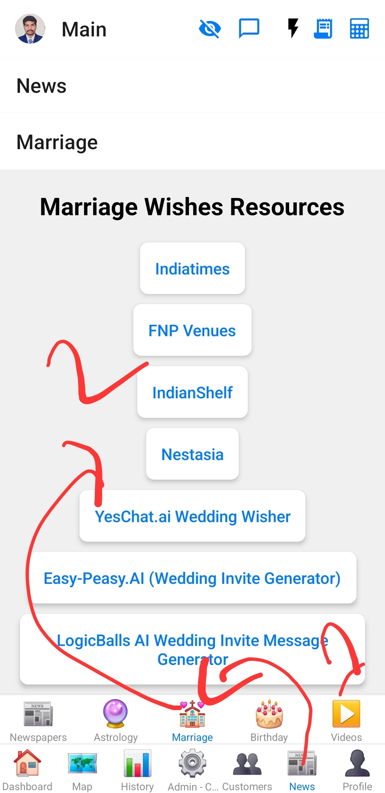

# Marriage Screen

This screen provides a list of external web resources related to marriage wishes and content generation.

## Purpose

To provide users with quick access to online resources for marriage-related content.

## Functionality
*   **Resource List:** Displays a list of external websites and AI tools related to marriage wishes, quotes, and invitation message generation.
*   **External Linking:** When a resource is tapped, it opens the corresponding URL in the device's default web browser.

## Data Sources
*   Hardcoded list of external websites/tools.

## Components Used
*   `ScrollView` (from React Native)
*   `TouchableOpacity` (from React Native)
*   `Linking` (from `react-native`)

## Images

