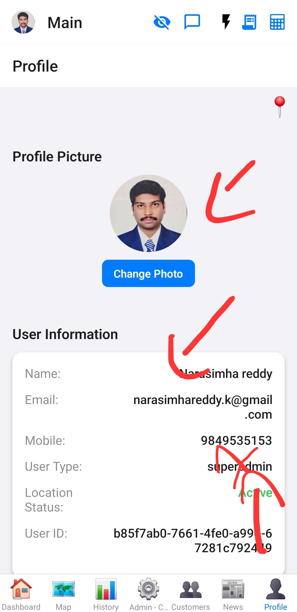
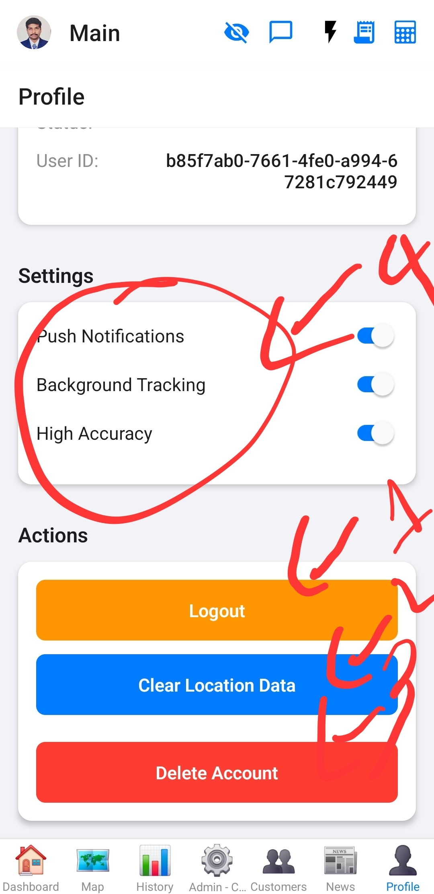

# Profile Screen

This screen allows users to view and manage their personal profile information.

## Purpose

To provide users with a dedicated section to update their details, change passwords, or manage other profile-related settings.

## Functionality
*   **Profile Picture Management:** Displays the user's profile image and allows changing it by picking from the gallery or taking a new photo. Uploads images to Supabase Storage.
*   **User Information Display:** Shows user details such as Name, Email, Mobile, User Type, Location Status (Active/Inactive), and User ID.
*   **Settings Management:** Provides toggles for Push Notifications, Background Tracking, and High Accuracy Location. Includes an option to enable notifications if not already granted.
*   **Account Actions:** Includes options to Logout (with offline expense handling), Clear Location Data, and Delete Account.
*   **Location Picker Modal:** Allows the user to set or update their geographical location on an interactive map within a modal.
*   **Offline Data Handling:** Integrates with `OfflineStorageService` for managing offline expenses.
*   **Push Notification Registration:** Uses `notificationService` to register for push notifications.

## Data Sources
*   Supabase (for user profiles, authentication, location history, storage).
*   `expo-location` (for location permissions and current location).
*   `expo-image-picker` (for profile image selection).
*   `OfflineStorageService` (custom service for offline data).
*   `notificationService` (custom service for push notifications).

## Components Used
*   [`LeafletMap`](../../src/components/LeafletMap.js)
*   [`LocationSearchBar`](../../src/components/AreaSearchBar.js) (Note: `AreaSearchBar` is used as a location search bar here)
*   `Modal` (from React Native)
*   `Switch` (from React Native)

## Images

