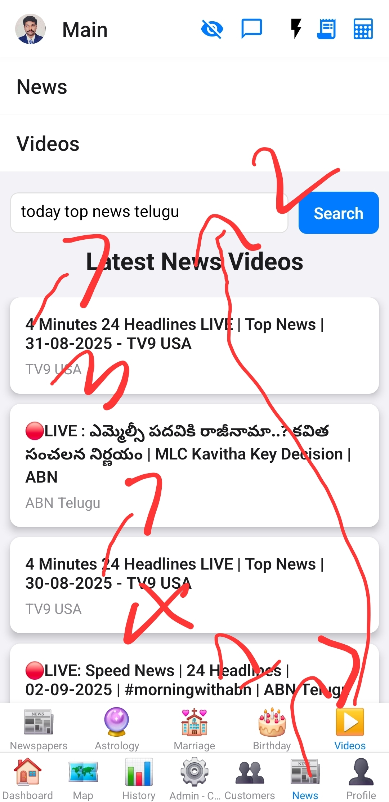
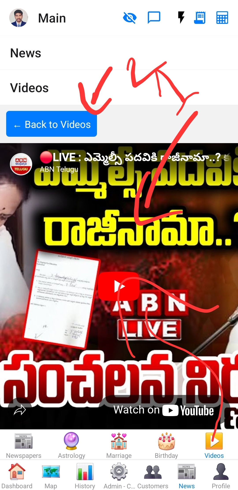

# YouTube Screen

This screen is designed to search for and play YouTube videos directly within the app.

## Purpose

To provide users with access to video content directly within the application.

## Functionality
*   **YouTube Video Search:** Allows users to search for YouTube videos using a text input.
*   **Video List Display:** Shows a list of search results, displaying the video title and channel.
*   **In-App Video Player:** When a video from the list is selected, a `WebView` component loads and plays the YouTube video directly within the app.
*   **Back Button:** Provides a "Back to Videos" button within the video player view to return to the search results list.
*   **API Integration:** Fetches video data using the YouTube Data API.
*   **Loading Indicator:** Displays a loading indicator while fetching videos.
*   **Error Handling:** Alerts the user for API errors or network issues.

## Data Sources
*   YouTube Data API v3

## Components Used
*   `WebView` (from `react-native-webview`)
*   `FlatList` (from React Native)
*   `TextInput` (from React Native)
*   `TouchableOpacity` (from React Native)
*   `ActivityIndicator` (from React Native)

## Images

